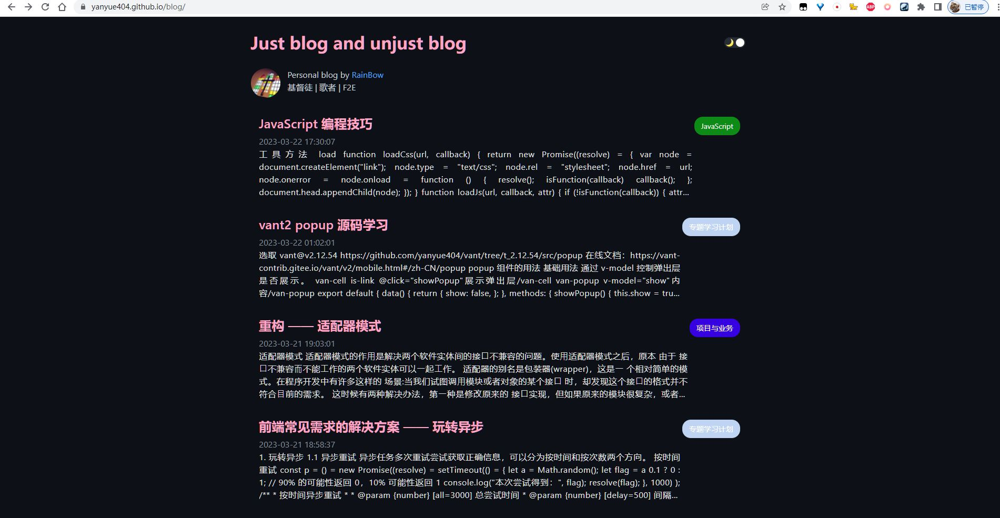

# Nuxt Issue Blog

基于 [GitHub API](https://docs.github.com/en/rest/issues/issues) 的博客静态站点生成工具，尽情享受用 GitHub Issue 写博客带来的便利吧！

## Features

- 采用 ssg 静态站点，快速部署上线
- 支持首屏服务端渲染
- 支持 github 账号评论
- 支持暗黑主题
- github action 自动部署
- markdown 博客文章标题导航栏

## TODO

- markdown 博客文章在线编辑功能

## Demo

https://yanyue404.github.io/blog




## Usage

### 准备工作

#### 开发环境依赖

```
- git: ^v2.0.0
- node: ^v12.18.3
- yarn: ^v1.12.0
```

#### 获取 GitHub Token

点击 [这里](https://github.com/settings/tokens/new)，勾选以下两项：

```
read: user        Read all user profile data
user: email       Access user email addresses (read-only)
```

⚠️ 警告️：别的不要勾选，以免造成账号安全问题。

如果你的项目是属于一个组织的，还需要勾选一个权限：

```
read: org         Read org and team membership
```

#### GitHub Token 进行 Base64 加密

打开 Chrome 的 Console，运行：

```
window.btoa('{你的 GitHub Token}')
```

如果你把 Token 直接明文推到 GitHub 仓库中，此 Token 就会立马失效，所以需要加密混淆。

### 开始部署

1. Fork 此项目到自己仓库；
2. 将代码克隆到本地；
3. 编辑 `blog.config.js` 文件；
4. 安装依赖：`yarn install`；
5. 查看效果： `yarn serve`， 本地预览 `localhost:7711`;
6. 打包：`yarn dev|build`；
7. 部署：`yarn deploy`；
8. 浏览器地址栏输入：`{你的用户名}.github.io/blog` 查看。
